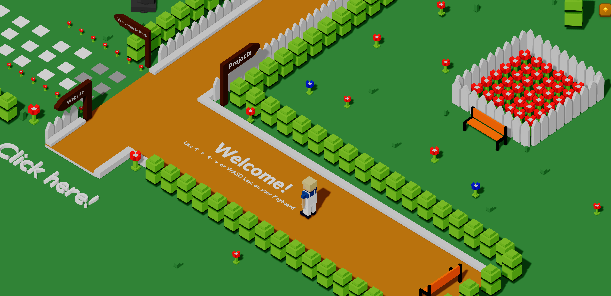
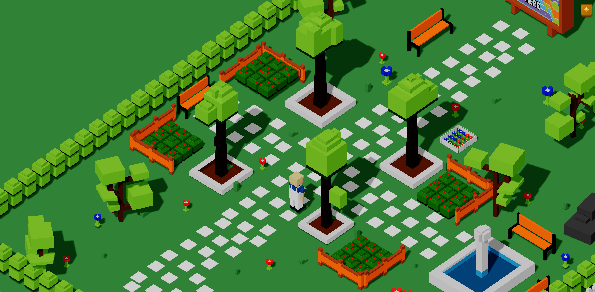
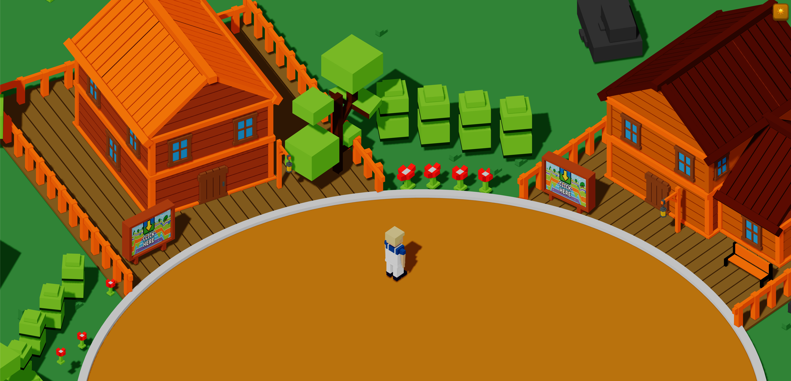

# Three.js Interactive 3D Portfolio

A fully interactive, isometric 3D portfolio built with Three.js and vanilla JavaScript. Navigate a custom 3D world with a character you control, click on objects to open project modals, and toggle between light and dark themes — all rendered live in the browser.

**[Live Demo →]([https://three-js-portfolio-sandy.vercel.app](https://emres-portfolio.vercel.app/))**

---

## Features

- **Walkable 3D scene** — Control a character through a custom `.glb` environment using keyboard or mobile on-screen controls
- **Physics & collision** — Capsule collider with Octree-based collision detection; character respawns if it falls off the map
- **Raycaster interactions** — Click on named scene objects (`Project_1`, `Project_2`, `Advertise`, `Character`) to open detail modals
- **Dark / light theme** — Persisted via `localStorage`; GSAP animates lighting transitions smoothly in real-time
- **Cinematic loading screen** — GSAP timeline fades out once the GLB model finishes loading
- **Jump animation** — Scale-squash-stretch animation plays on every character jump
- **Mobile support** — On-screen directional pad with `touchstart`/`touchend` controls; pointer events work across devices
- **Orthographic camera** — Isometric-style camera that follows the character at a fixed offset
- **Responsive** — Canvas and camera recalculate on window resize

---

## Tech Stack

| Layer | Technology |
|---|---|
| 3D Rendering | [Three.js](https://threejs.org/) |
| Animation | [GSAP](https://gsap.com/) |
| 3D Model | Blender → `.glb` (GLTF) |
| Physics | Three.js `Capsule` + `Octree` |
| Deployment | [Vercel](https://vercel.com/) |
| Language | Vanilla JavaScript (ES Modules) |

---

## Preview





## Getting Started

### Prerequisites

- A modern browser with WebGL support
- A local static file server (required for ES module imports and `.glb` loading)

### Installation

```bash
# Clone the repository
git clone https://github.com/eemraydin/ThreeJs-Portfolio.git
cd ThreeJs-Portfolio
```

### Running Locally

Since the project uses ES modules and loads a local `.glb` file, you must serve it over HTTP — opening `index.html` directly will not work.

```bash
# Option 1: VS Code Live Server extension (recommended)
# Right-click index.html → "Open with Live Server"

# Option 2: Node.js http-server
npx http-server .

# Option 3: Python
python -m http.server 8080
```

Then open `http://localhost:8080` (or the port shown) in your browser.

---

## Controls

### Keyboard

| Key | Action |
|---|---|
| `W` / `↑` | Move forward |
| `S` / `↓` | Move backward |
| `A` / `←` | Move left |
| `D` / `→` | Move right |
| `R` | Respawn character |
| `Escape` | Close modal |

### Mouse / Touch

| Input | Action |
|---|---|
| Click / Tap on object | Open project modal |
| On-screen D-pad | Move character (mobile) |

---

## Project Structure

```
ThreeJs-Portfolio/
├── index.html          # App shell, modal markup, mobile controls, loading screen
├── main.js             # Three.js scene, physics, controls, theming, and UI logic
├── style.css           # Theming, modal styles, mobile controls, loading screen
└── portfolioV6.glb     # Custom 3D scene exported from Blender
```

---

Thank you Andrew Woan! You are best!
